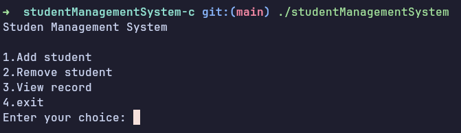
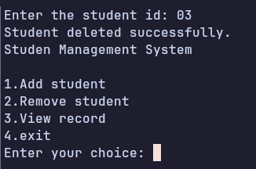
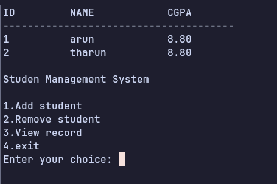

# CLI Student Management System Program in C

## Description
It is a CLI based Student Management System  where we can add students data , deleted data , view stored data.
Deletion of data is done based on student id. 

## Concepts Learned 
I have Learned how to use malloc(dynamic memeory management),
and how to read, write, and append file,
how to use functions and use function prototype,
how to use typedef with struct.

## Output

